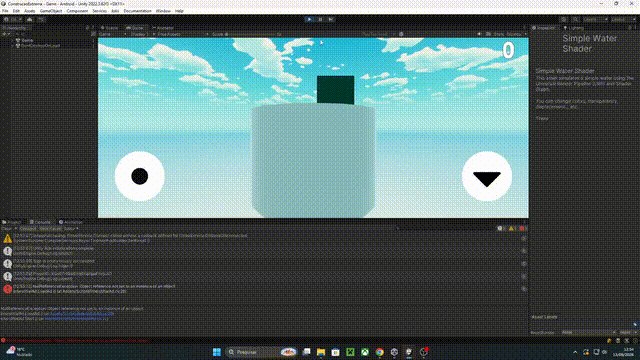

# 🎮 Construção Extrema

Jogo completo desenvolvido na **Unity** utilizando **C#**, criado durante meu processo de aprendizado em desenvolvimento de jogos através da comunidade **Desenvolvedor Unity**.

## 📖 Sobre o projeto

O Construção Extrema foi desenvolvido como um projeto de estudo, acompanhando o desenvolvimento passo a passo na comunidade Desenvolvedor Unity.

O projeto permitiu colocar em prática conceitos de programação em C#, utilização da Unity e desenvolvimento de diferentes sistemas necessários para construir um jogo completo.

## 🛠️ Tecnologias

- Unity
- C#
- Git
- GitHub

## 🎮 Funcionalidades

- Gameplay completo
- Mecânicas de jogo
- Interface de usuário (UI)
- Sistemas de gameplay
- Animações
- Controle do jogador
- Organização de projeto na Unity

## 🧠 Competências desenvolvidas

- C#
- Lógica de programação
- Unity Engine
- Desenvolvimento de jogos 3D
- Programação de gameplay
- Implementação de mecânicas
- Interface de usuário
- Debugging
- Organização de projetos
- Git e GitHub

## 📹 Demonstração

### Gameplay

[▶️ Assistir ao vídeo completo](./Construcao-Extrema-demo.mp4)
## 📚 Créditos

Projeto desenvolvido acompanhando o conteúdo e as orientações da comunidade **Desenvolvedor Unity**.

## 👨‍💻 Desenvolvedor

**Guilherme Alves Fandeveda**

Projeto desenvolvido como parte do meu processo de aprendizado em **C# e Unity**, buscando evoluir minhas habilidades em programação e desenvolvimento de jogos.
